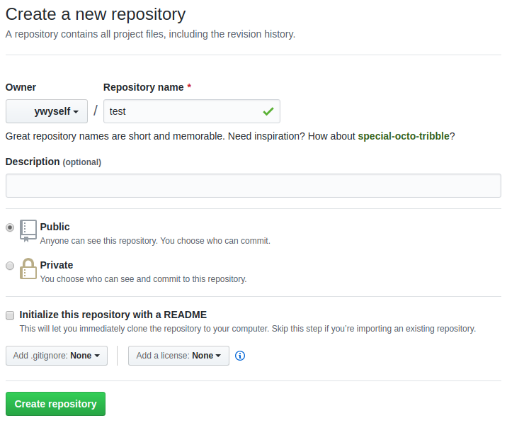

# git 的基本用法

## 从远程仓库克隆项目，并提交更新

### 从github克隆（下载）项目到本地目录
> 下载项目到/home/com/github/pages文件夹下

git clone <远程仓库地址> <本地仓库地址>
```bash
git clone https://github.com/ywyself/pages.git /home/com/github/pages
```

### 添加更新的文件到索引中
> 将文件加入暂存区

git add <修改后文件的路径>|<修改后文件所在目录的路径>
```bash
git add .
```

### commit文件
> 将暂存区的内容提交到当前分支

git commit -m <commit信息>
```bash
git commit -m "commit message"
```

### push上传
> 上传到git仓库中

```bash
git push
```

## 将新项目提交到git仓库

### 建立远程仓库


### 创建本地仓库

```bash
mkdir test/
cd test/
touch readme.md
git init
```

### 连接远程仓库

```bash
git remote add origin https://github.com/ywyself/test.git
```

### 推送到远程仓库

强制覆盖远程仓库
```bash
git push -f origin master
```
