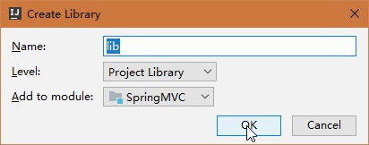

# 创建SpringMVC框架的项目
> 用idea创建一个SpringMVC框架项目

### 创建一个javaEE的web项目


### 指定项目名称和存放位置


### 引入SpringMVC的依赖jar包，并添加为项目的lib
> 必需的依赖jar包


> 添加为项目的lib





### 在src下新建文件夹
> 目录结构，首先取消src的`Source Root`标记，再标记`main`文件夹下，标记`test`文件夹下的为`Test`


### 新建SpringMVC的配置文件`springmvc-config.xml`

```xml
<?xml version="1.0" encoding="UTF-8"?>
<beans xmlns="http://www.springframework.org/schema/beans"
       xmlns:xsi="http://www.w3.org/2001/XMLSchema-instance"
       xsi:schemaLocation="http://www.springframework.org/schema/beans http://www.springframework.org/schema/beans/spring-beans.xsd">

    <!--配置视图解析器-->
    <bean class="org.springframework.web.servlet.view.InternalResourceViewResolver">
        <!--视图文件路径前缀-->
        <property name="prefix" value="/view/"/>
        <!--视图文件路径后缀-->
        <property name="suffix" value=".jsp"/>
    </bean>

</beans>
```

### 修改`web.xml`文件
> 修改`web.xml`文件，用springmvc来处理所有的请求

```xml
<?xml version="1.0" encoding="UTF-8"?>
<web-app xmlns="http://xmlns.jcp.org/xml/ns/javaee"
         xmlns:xsi="http://www.w3.org/2001/XMLSchema-instance"
         xsi:schemaLocation="http://xmlns.jcp.org/xml/ns/javaee http://xmlns.jcp.org/xml/ns/javaee/web-app_4_0.xsd"
         version="4.0">
    <servlet>
        <!--servlet的名称-->
        <servlet-name>springmvc</servlet-name>
        <!--servlet对应的java类-->
        <servlet-class>org.springframework.web.servlet.DispatcherServlet</servlet-class>
        <!--当前servlet的参数信息-->
        <init-param>
            <!--参数名称contextConfigLocation，该参数的值包含SpringMVC配置文件的路径-->
            <param-name>contextConfigLocation</param-name>
            <param-value>WEB-INF/springmvc-config.xml</param-value>
        </init-param>
        <!--在web应用启动时立即加载servlet-->
        <load-on-startup>1</load-on-startup>
    </servlet>
    <!--servlet映射声明-->
    <servlet-mapping>
        <!--请求对应的servlet-->
        <servlet-name>springmvc</servlet-name>
        <!--监听当前域的请求-->
        <url-pattern>/</url-pattern>
    </servlet-mapping>
</web-app>
```

### 新建一个`IndexController`控制器
> 新建一个控制器


```java
package cn.ywyself.controller;

import org.springframework.stereotype.Controller;
import org.springframework.web.bind.annotation.GetMapping;
import org.springframework.web.bind.annotation.RequestMapping;
import org.springframework.web.servlet.ModelAndView;

@Controller
@RequestMapping("/") // 为此类中的方法设置一个根路径
public class IndexController {

    /**
     * 绑定get请求路径
     * @return 根据模板渲染的视图响应客户端
     */
    @GetMapping("")
    public ModelAndView index() {
        return new ModelAndView("index");
    }
}
```

> 新建一个视图文件


```html
<html>
  <head>
    <title>Index</title>
  </head>
  <body>
  Index Page
  </body>
</html>
```


### 修改`web.xml`文件
> 在beans中添加以下内容，用来实现注解的自动扫描

```xml
<!--spring 自动扫描base-package包和子包下的java文件，如果扫描到有spring相关的注解的类，则把这些类注册为spring的bean-->
<context:component-scan base-package="cn.ywyself.controller"/>
```

> 添加以下内容，使用默认的静态资源处理方案

```xml
<!-- 静态资源处理 默认的处理方案 -->
<mvc:default-servlet-handler/>
```
> 配置annotation类型的处理器映射器、适配器

```xml
<!--配置annotation类型的处理器映射器-->
<bean class="org.springframework.web.servlet.mvc.method.annotation.RequestMappingHandlerMapping"/>
<!--配置annotation类型的处理器适配器-->
<bean class="org.springframework.web.servlet.mvc.method.annotation.RequestMappingHandlerAdapter"/>
```
> 也可以使用下面的方法来为配置annotation类型的处理器映射器、适配器

```xml
<!--annotation默认装配方案-->
<mvc:annotation-driven/>
```
---
到这里已经结束了