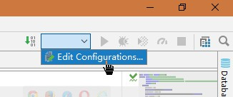
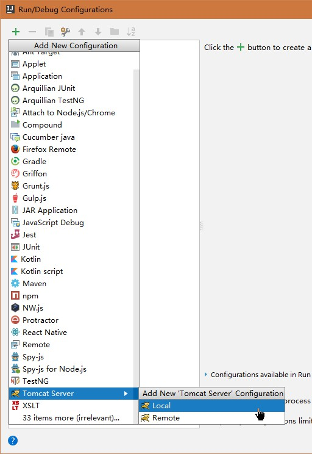
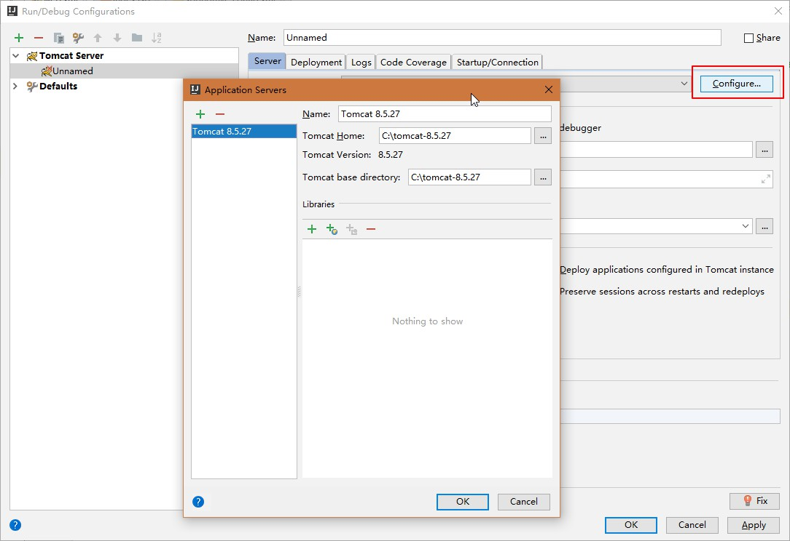
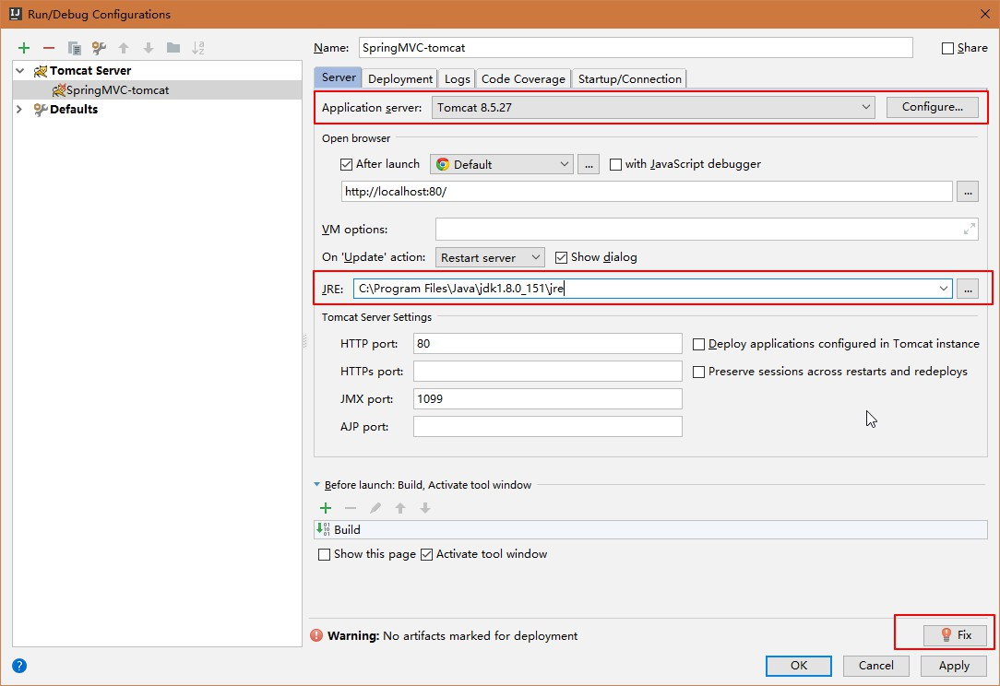
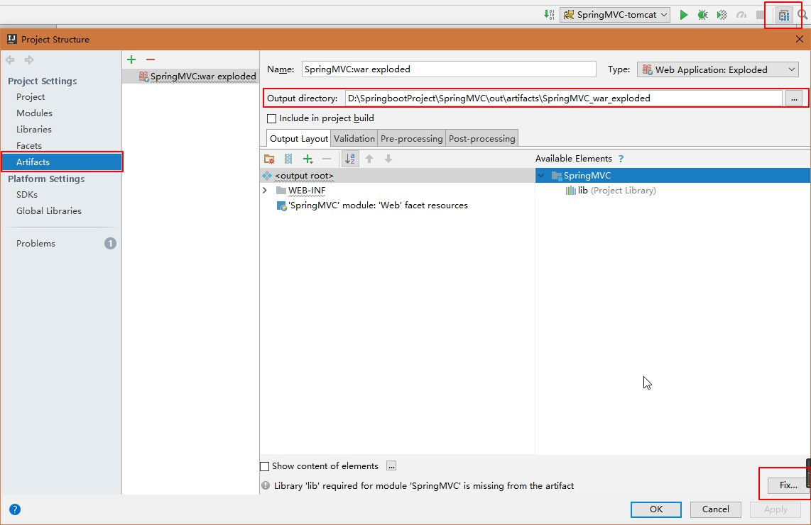
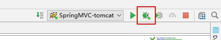
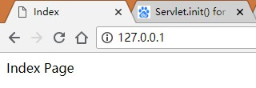

# 部署SpringMVC项目
> 部署SpringMVC项目到tomcat中，并在浏览器中打开地址，看到视图页面

### 添加一个tomcat服务器



### 配置一个tomcat的服务器
> 在本地配置一个tomcat的运行环境，根据下图设置tomcat服务器



### 配置用来运行项目的tomcat环境


### 修改项目部署的位置


### 启动调试


### 浏览器中打开访问


---
# 遇到的问题
```java
org.springframework.beans.factory.BeanCreationException: Error creating bean with name 'org.springframework.web.servlet.mvc.method.annotation.RequestMappingHandlerMapping': Initialization of bean failed; nested exception is java.lang.NoSuchMethodError: org.springframework.web.servlet.handler.AbstractHandlerMapping.obtainApplicationContext()Lorg/springframework/context/ApplicationContext;
...
Caused by: java.lang.NoSuchMethodError: org.springframework.web.servlet.handler.AbstractHandlerMapping.obtainApplicationContext()Lorg/springframework/context/ApplicationContext;
	at org.springframework.web.servlet.handler.AbstractHandlerMapping.detectMappedInterceptors(AbstractHandlerMapping.java:269)
	at org.springframework.web.servlet.handler.AbstractHandlerMapping.initApplicationContext(AbstractHandlerMapping.java:243)
```

---
结束了