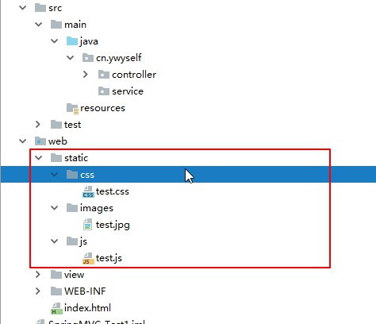
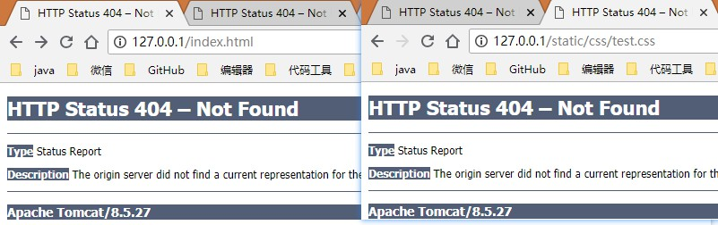
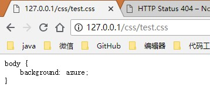

# 配置静态资源请求
不进行静态资源请求配置是无法访问css/js等资源文件，也无法访问html模板源码文件。
要求：允许访问普通的静态资源，不允许访问模板文件

## 使用默认的处理方案
在springmvc-config.xml文件中添加代码
```xml
<!-- 静态资源处理 默认的处理方案 -->
<mvc:default-servlet-handler/>
```
这种配置可以访问任何的静态资源，包括html模板源码。

## 自定义静态资源的请求路径和存放位置
### 修改springmvc-config.xml文件
去掉默认的处理方案，添加代码
```xml
<!--
静态资源 images
指定资源的存放位置为/static/images文件夹和子文件夹下的文件，请求的地址为/images
-->
<mvc:resources mapping="/images/**" location="/static/images/" cache-period="31556926"/>
<!--静态资源 js-->
<mvc:resources mapping="/js/**" location="/static/js/"/>
<!--静态资源 css-->
<mvc:resources mapping="/css/**" location="/static/css/"/>
```
### 静态资源位置目录结构


### 请求方式
已经无法根据项目结构请求到资源了

正确的请求方式

